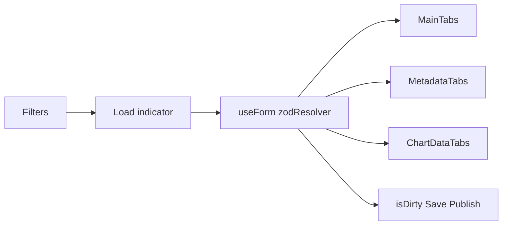

# План: форма для сторінки Indicators

Канонічна копія плану в проєкті: цей файл. Робоча директорія для імплементації — корінь репозиторію `armstat-admin`.

## Scope (узгоджено)

- **Робимо:** одна форма на основі **react-hook-form** + **Zod** + **`@hookform/resolvers/zod`**, як у [`src/components/auth/login-form.tsx`](src/components/auth/login-form.tsx); UI через [`src/components/ui/form.tsx`](src/components/ui/form.tsx).
- **Блок Հատկանիշներ** (`CreateWindow`, `FeaturesTable`) — **не підключаємо** до форми на першому етапі; залишається статичний UI / мок.
- **Պահպанել** (save) і **Հաստատել** (publish) — **`disabled`, якщо `!formState.isDirty`** (і за потреби `|| formState.isSubmitting`); після успішного запиту — **`reset(дані)`**, щоб скинути `isDirty`.
- **Չեղարկել** — `reset()` до останніх `defaultValues` (або навігація); опційно теж `disabled` при `!isDirty`.

## Поточний стан UI (коротко)

- Сторінка: [`src/app/(admin)/indicators/page.tsx`](src/app/(admin)/indicators/page.tsx) — картки + кнопки без реальної форми.
- Поля в `MainTabs`, `MetadataTabs`, `ChartDataTabs` — без зв’язку зі станом; фільтри в [`Filters.tsx`](src/components/indicators/Filters.tsx) — окремий локальний стан.

## Архітектура

- **Filters** окремо від payload форми: при зміні вибраного індикатора — `reset(defaultValues)` з моку або `GET`.
- Новий компонент на кшталт **`src/components/indicators/IndicatorsForm.tsx`**: `<Form {...methods}>` + `<form>`, всередині — секції з `FormField` / `useFormContext`.
- **Таби мов (EN/HY/RU):** усі значення в формі одночасно; таб лише перемикає видимість.

## Чернетка Zod (без features)

- `locales[en|hy|ru]`: title, description, link, unit, aggregatable.
- `metadata[locale]`: body, sourceUrl (за потреби узгодити з макетом).
- `charts[]`: link (+ placeholder прев’ю).
- `tableRows` — за потреби; CSV — окремий flow (`setValue` після імпорту).

## Порядок імплементації

1. `IndicatorsForm` + схема Zod + `defaultValues`.
2. Підключити **MainTabs** через `FormField`.
3. **MetadataTabs**, **ChartDataTabs**.
4. Кнопки: `isDirty` / `reset` після save.
5. Зв’язок **Filters** → `reset` при виборі індикатора.
6. Реальний API, коли буде контракт.
7. **Пізніше:** блок **Հատկանիշներ** (`useFieldArray` + діалог).

## Що лишається відкритим (бекенд)

- Формат PATCH / окремий publish endpoint чи поле `status`.
- Чи таблиця даних лише з CSV чи ще редагується в UI.

Після цього — зафіксувати фінальну Zod-схему та payload.

